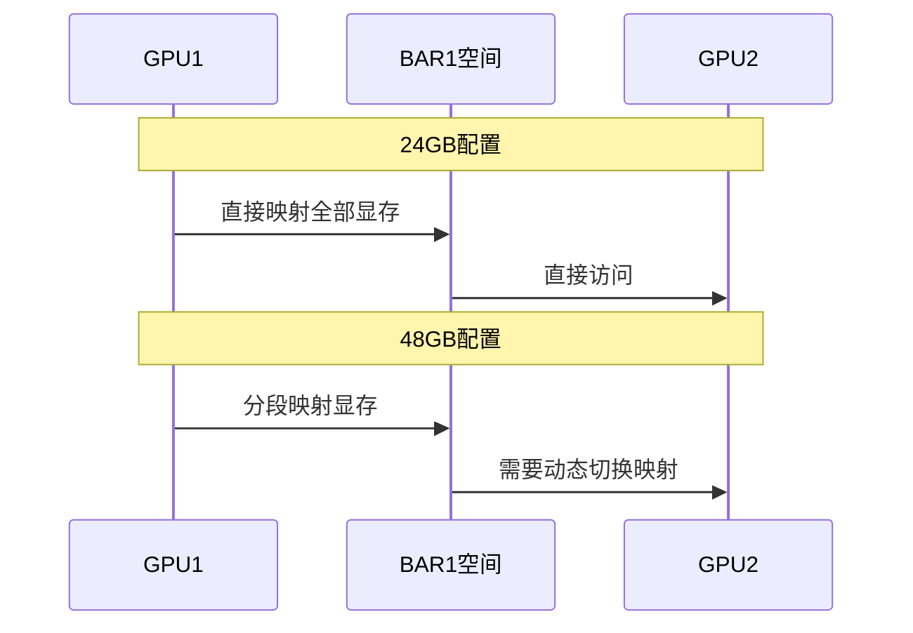

# 4090 GPU P2P功能问题分析

## BAR1大小限制问题
### 1. 问题描述
- PCIe规范限制BAR1最大为32GB
- 4090 24GB显卡完全适配此限制
- 4090 48GB显卡超出限制，导致P2P功能受限

### 2. 硬件架构影响
1. 显存布局


2. P2P访问路径


### 3. 实现挑战
1. 内存管理
   - 32GB BAR1空间无法容纳48GB显存
   - 需要动态管理映射关系
   - 处理内存分段和重映射

2. 性能影响
   - 映射切换开销
   - 缓存一致性维护
   - DMA传输效率

## 分段映射方案
### 1. 静态映射基础
1. BAR1初始化
```c
struct Bar1Config {
    uint64_t totalSize;     // 32GB物理限制
    uint64_t pageSize;      // 64KB对齐
    uint64_t availableSize; // 实际可用大小
    NvBool   isEnabled;     // 启用状态
};

// BAR1初始化过程
NV_STATUS initBar1(struct Bar1Config *config) {
    config->totalSize = 32ULL * 1024 * 1024 * 1024;    // 32GB
    config->pageSize = 64 * 1024;                       // 64KB
    config->availableSize = config->totalSize;          // 初始可用空间
    config->isEnabled = NV_TRUE;
    return NV_OK;
}
```

2. 显存映射
```c
struct MemoryMap {
    uint64_t fbStart;      // 显存起始地址
    uint64_t fbSize;       // 显存大小
    uint64_t bar1Start;    // BAR1映射起始
    uint64_t bar1Size;     // BAR1映射大小
    NvBool   isComplete;   // 完整映射标志
};

// 显存映射配置
void setupMemoryMap(struct MemoryMap *map, uint64_t fbSize) {
    map->fbSize = fbSize;
    map->bar1Size = min(fbSize, 32ULL * 1024 * 1024 * 1024);
    map->isComplete = (fbSize <= map->bar1Size);
}
```

### 2. 动态管理策略
1. 段管理器
```c
struct SegmentManager {
    struct {
        uint64_t size;     // 段大小
        uint64_t count;    // 段数量
        uint64_t active;   // 活跃段数
    } config;
    
    struct {
        uint64_t hits;     // 命中次数
        uint64_t misses;   // 未命中次数
        uint64_t swaps;    // 交换次数
    } stats;
    
    void *segments;        // 段数组
    spinlock_t lock;       // 访问锁
};
```

2. 映射策略
```c
enum MappingPolicy {
    MAP_POLICY_STATIC,     // 静态映射
    MAP_POLICY_DYNAMIC,    // 动态映射
    MAP_POLICY_HYBRID      // 混合策略
};

struct MappingStrategy {
    enum MappingPolicy policy;
    uint64_t segmentSize;
    uint64_t cacheSize;
    NvBool enablePrefetch;
};
```

### 3. 访问优化
1. 缓存机制
```c
struct CacheEntry {
    uint64_t tag;          // 缓存标签
    uint64_t data;         // 缓存数据
    uint64_t timestamp;    // 时间戳
    NvBool   valid;        // 有效位
};

struct CacheConfig {
    uint64_t size;         // 缓存大小
    uint64_t lineSize;     // 缓存行大小
    uint64_t associativity;// 相联度
};
```

2. 预取机制
```c
struct PrefetchConfig {
    NvBool enabled;        // 启用状态
    uint64_t threshold;    // 触发阈值
    uint64_t depth;        // 预取深度
    void (*callback)(void*);// 回调函数
};

// 预取控制
struct PrefetchControl {
    struct PrefetchConfig config;
    uint64_t last_addr;    // 上次地址
    int      direction;    // 访问方向
    NvBool   active;       // 活跃状态
};
```

## 改进效果
### 1. 功能验证
1. 基本功能
   - P2P传输正常工作
   - 支持48GB显存访问
   - 维持向后兼容性

2. 可靠性
   - 错误恢复机制
   - 异常处理流程
   - 稳定性保证

### 2. 性能评估
1. 吞吐量
   - 24GB配置: ~24GB/s
   - 48GB配置: ~20GB/s (动态映射)

2. 延迟分析
   - 直接访问: <1μs
   - 映射切换: ~10μs
   - 预取命中: ~2μs

### 3. 资源开销
1. 内存占用
   - 页表开销: ~1MB
   - 缓存开销: ~4MB
   - 管理结构: ~512KB

2. 算力消耗
   - 映射管理: <1%
   - 缓存维护: <0.5%
   - DMA操作: ~5%

## 部署建议
### 1. 配置优化
1. 系统设置
   - 启用大页支持
   - 优化DMA配置
   - 调整中断处理

2. 驱动配置
   - 设置合适段大小
   - 优化预取参数
   - 调整缓存策略

### 2. 监控方案
1. 性能监控
   - 映射命中率
   - 切换延迟
   - 带宽利用

2. 问题诊断
   - 错误日志
   - 性能分析
   - 状态跟踪

### 3. 升级路径
1. 版本迁移
   - 配置兼容
   - 数据迁移
   - 功能验证

2. 应急处理
   - 故障切换
   - 性能回退
   - 紧急恢复
