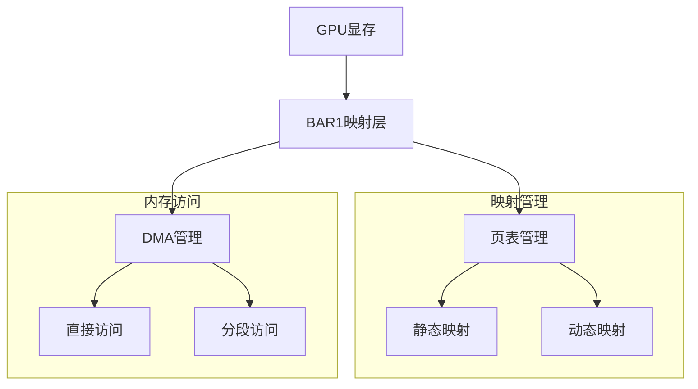
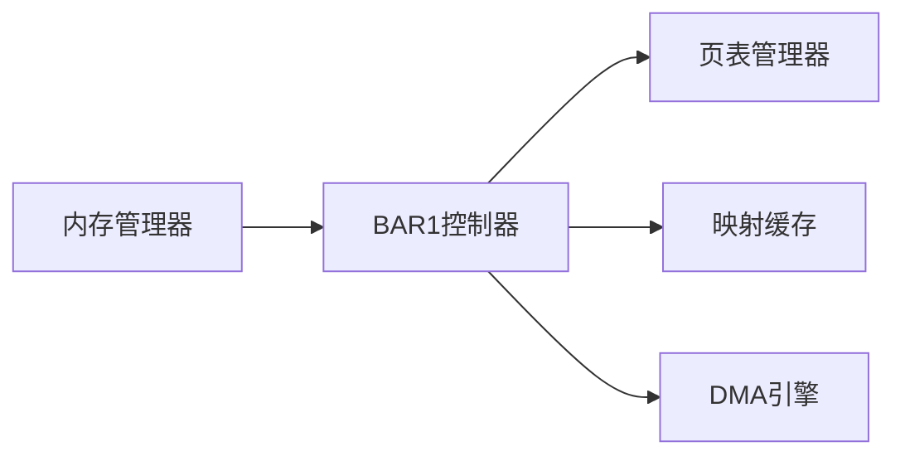
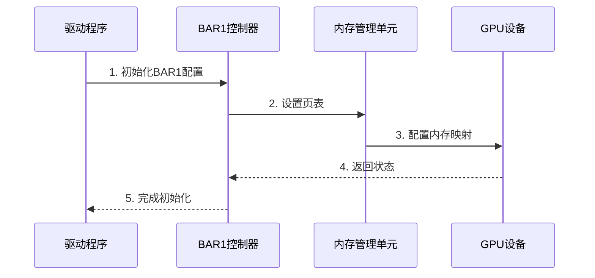
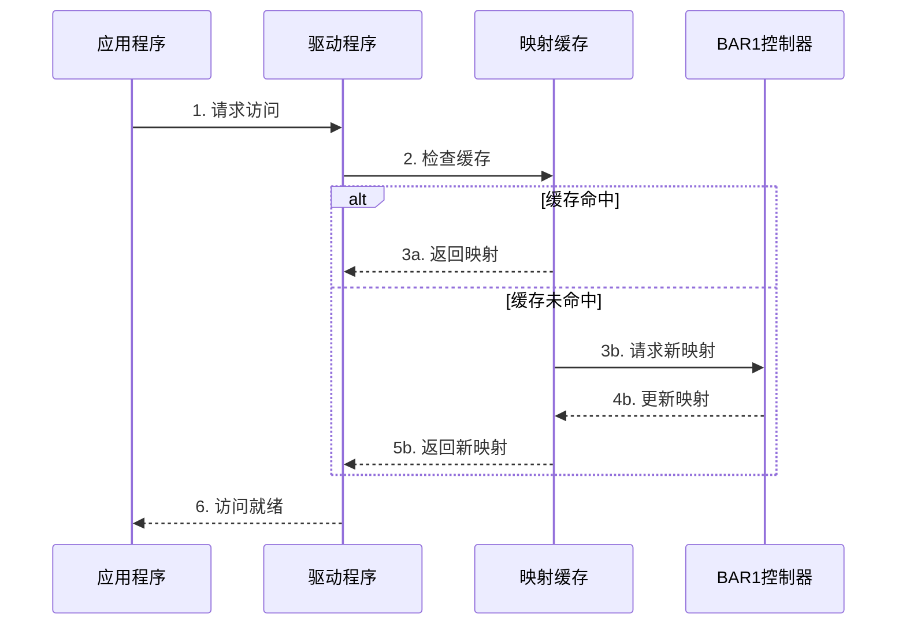
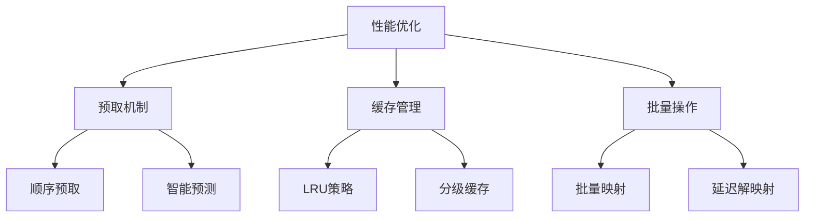
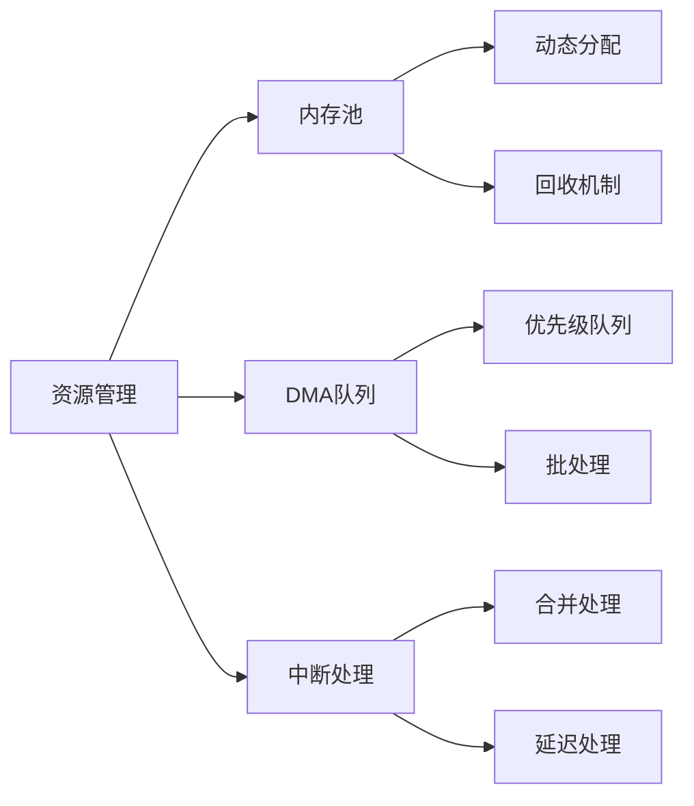
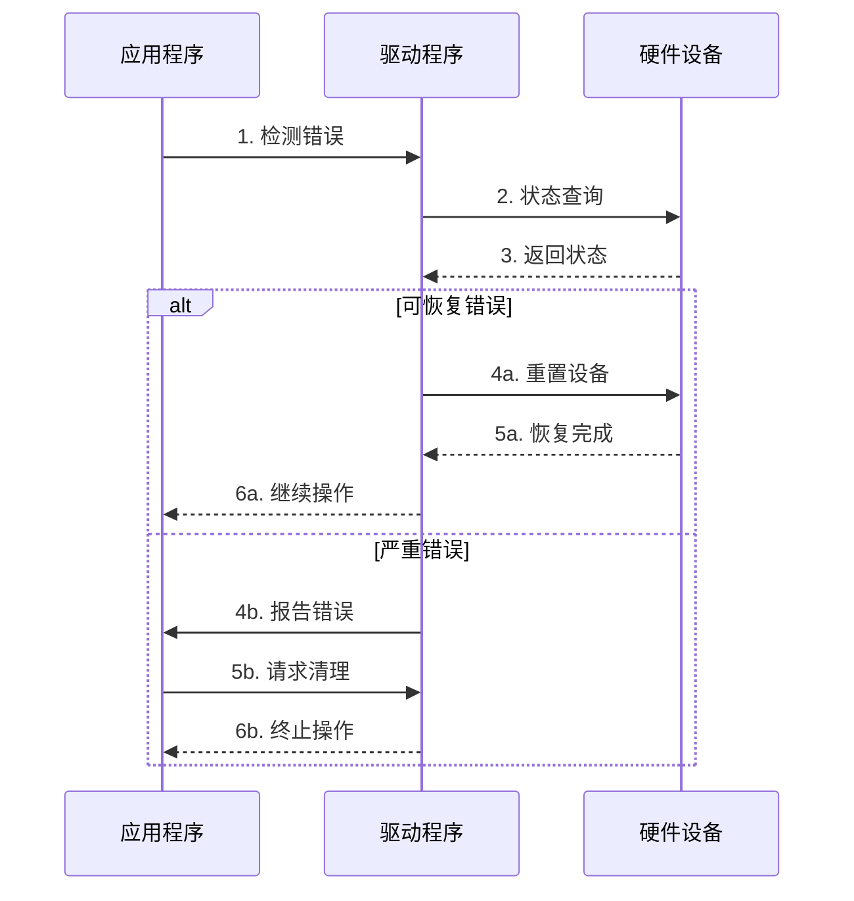

# GPU BAR1映射系统架构

## 1. 系统概述
### 架构图


### 核心组件


## 2. 关键流程
### 初始化流程


### 映射切换流程


## 3. 关键模式
### 显存映射模式


### 缓存策略


## 4. 数据结构
### 基础组件
```c
// BAR1配置
struct Bar1Configuration {
    uint64_t baseAddress;     // 基地址
    uint64_t size;           // 总大小
    uint64_t pageSize;       // 页面大小
    NvBool   isEnabled;      // 启用标志
};

// 映射描述符
struct MappingDescriptor {
    uint64_t virtualAddress;  // 虚拟地址
    uint64_t physicalAddress; // 物理地址
    uint64_t size;           // 映射大小
    NvU32    flags;          // 标志位
    void    *privateData;     // 私有数据
};
```

### 管理结构
```c
// 段描述符
struct SegmentDescriptor {
    uint64_t startAddr;      // 起始地址
    uint64_t endAddr;        // 结束地址
    uint64_t size;          // 段大小
    NvBool   isActive;      // 活动状态
    struct {
        uint64_t hits;      // 命中次数
        uint64_t misses;    // 未命中次数
    } stats;
};

// 映射缓存
struct MappingCache {
    struct list_head lru;    // LRU链表
    struct rb_root tree;     // 红黑树
    spinlock_t lock;        // 访问锁
    uint32_t count;         // 条目数
    uint32_t maxCount;      // 最大条目
};
```

## 5. 优化模式
### 性能优化


### 资源管理


## 6. 错误处理
### 错误恢复流程


### 错误处理策略
1. 映射错误
```c
enum MappingErrorType {
    ERR_INVALID_ADDRESS,    // 无效地址
    ERR_OUT_OF_MEMORY,     // 内存不足
    ERR_ACCESS_DENIED,     // 访问被拒绝
    ERR_HARDWARE_FAULT     // 硬件故障
};

struct MappingError {
    enum MappingErrorType type;
    uint64_t address;
    uint32_t flags;
    char message[256];
};
```

2. 恢复机制
```c
struct RecoveryStrategy {
    uint32_t maxRetries;    // 最大重试次数
    uint32_t backoffTime;   // 退避时间
    NvBool   enabled;       // 启用状态
    void (*recoveryHandler)(void*); // 恢复处理函数
};
```

## 7. 监控和调试
### 性能计数器
```c
struct PerformanceCounters {
    struct {
        atomic64_t total;    // 总请求数
        atomic64_t success;  // 成功数
        atomic64_t failed;   // 失败数
    } requests;
    
    struct {
        atomic64_t hits;     // 缓存命中
        atomic64_t misses;   // 缓存未命中
    } cache;
    
    struct {
        uint64_t min;        // 最小延迟
        uint64_t max;        // 最大延迟
        uint64_t avg;        // 平均延迟
    } latency;
};
```

### 调试支持
```c
struct DebugInfo {
    uint32_t logLevel;      // 日志级别
    NvBool   traceEnabled;  // 跟踪启用
    
    struct {
        uint64_t timestamp; // 时间戳
        char message[512];  // 消息
        uint32_t severity;  // 严重程度
    } lastError;
    
    struct {
        void *buffer;      // 跟踪缓冲区
        uint32_t size;     // 缓冲区大小
        spinlock_t lock;   // 访问锁
    } trace;
};
